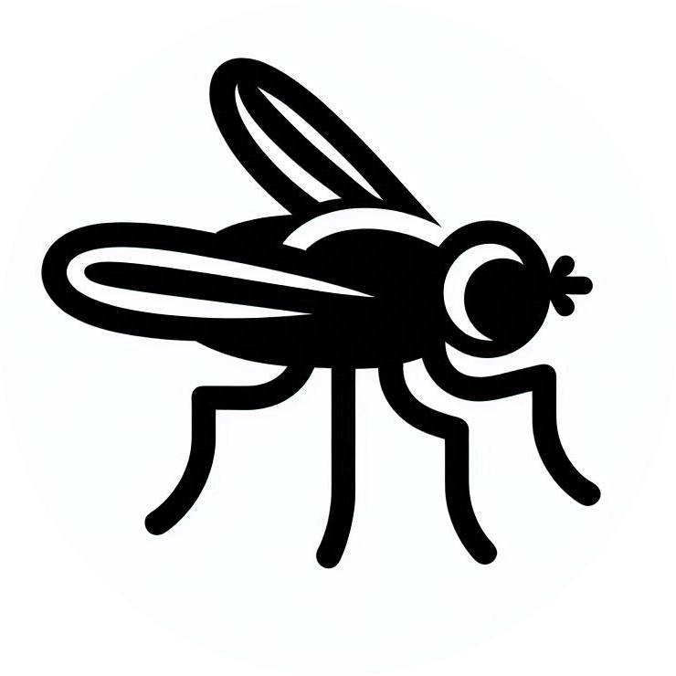

# Seasonal Dynamics of Decomposition Ecology

A collection of code used in the analysis and visualization of 16S sequencing data (among other things) @ Michigan State University over the course of my master's degree. Concerns the effect of abiotic and biotic influences on postmortem microbiome community assemblage/succession over time and across different seasons (spring, summer, and fall).

## Associated publications
- [Seasonal Dynamics of Decomposition Ecology](https://ezproxy2.library.colostate.edu/login?url=https://www.proquest.com/dissertations-theses/seasonal-dynamics-decomposition-ecology/docview/3094366274/se-2?accountid=10223)
  - Thesis, Published to ProQuest 2024
